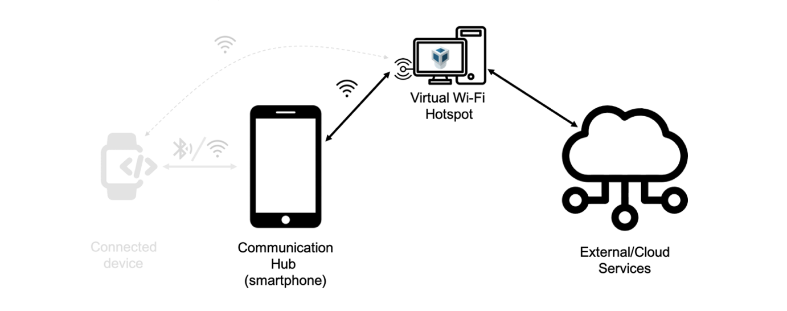

# <Your-Project-Title>
## 
 

  
The security and privacy tests that are interesting to study in home IoT devices are detailed below:
 - **Authentication**: the application associated with the smart home IoT device implements a method to authenticate the user's identity.
 - **Insecure pairing method**: the link between the smart home IoT device and the mobile app uses a pairing method considered insecure or ineffective against MITM or passive eavesdropping attacks and lacks privacy safeguards.
 - **Unencrypted Communications**: the Wi-Fi communication between the smart home IoT device and mobile app is not encrypted. 
 - **Static MAC address**: the smart home IoT device uses a static MAC address (i.e., it does not change when the device is turned off or restarted), exposing it to tracking and user identification attacks.
 - **Transmission of sensitive information to third-party servers**: the managing smart home IoT device application sends sensitive user information to third-party servers.
 - **Sending of information and firmware updates via HTTP**: The mobile app receives firmware updates and sends requests with sensitive information using HTTP without TLS.

 
## 
 

 
The security and privacy tests performed to the home IoT devices have been carried out within the virtual environment described below.

  
  

For its part, the operation process performed during the analysis of smart home IoT devices is the following:
 - Installing the recommended mobile application for managing the device.
 - Plugging the device.
 - Switching on the device, if necessary, and the mobile application.
 - HTTP data collection activities:
   - Pairing of smart home IoT device and the smartphone.
   - Turning on and use the device.
   - Device shutdown.
 - Disconnection.

 
## 

 
The results of security and privacy tests show that those low-cost devices have certain shortcomings in terms of encryption of pairing information. Specifically, these devices send the SSID and WPA password without any encryption during the initial pairing and confirmation process. This unprotected information exchange can lead to a takeover situation of the home Wi-Fi network.
 
On the other hand, high-end commercial devices use robust and secure pairing methods such as ZeroConf, which ensures a secure communication from the initial moment of use of this type of device.

